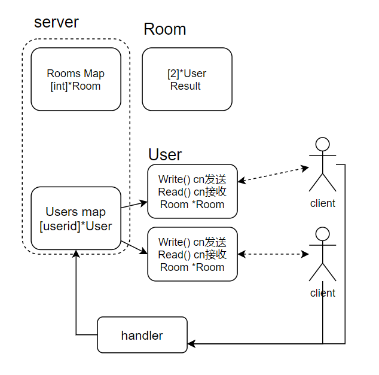
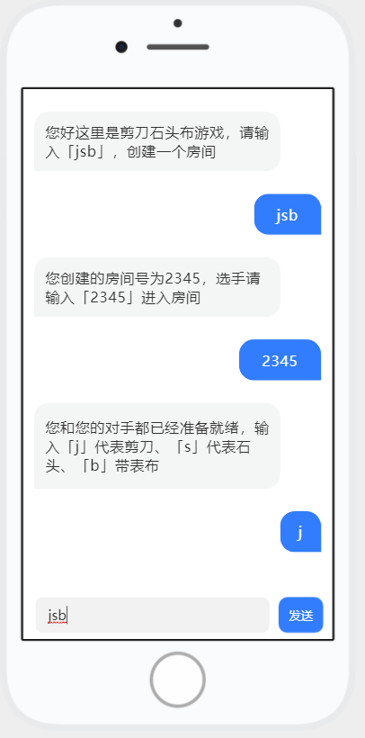
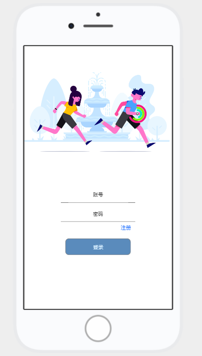
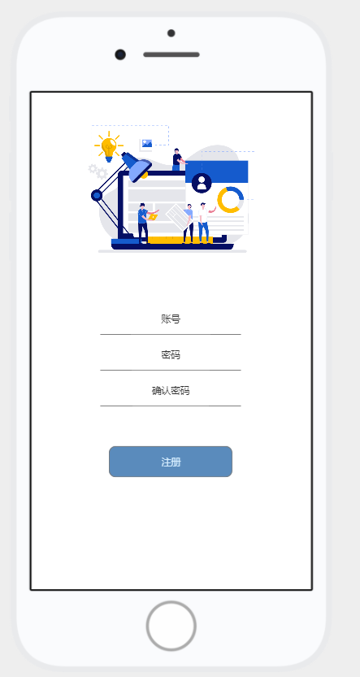

## 一个简单的剪刀石头布
前端使用 uniapp

[前端代码https://github.com/dengjiawen8955/jsb-uniapp.git](https://github.com/dengjiawen8955/jsb-uniapp.git)

客户端下载地址[点击下载](README.assets/jsb即时通信102.apk)

后端使用 go

* 登录使用 HTTP 然后

* 状态储存使用 jwt token  验证

* 游戏过程保持 websocket 连接
### 实现思路


* 前端进入 index 页面的时候 Onload() 创建 websocket
  * 前端注册 websocketTask 并储存保持通信，并且 onMessage() 保持监听服务端信息
  * 后端在 Server 里面的全局 Users 池子里面增加 User 并链接 conn 保持通信，Read() 监听客户端信息
* 前端甲发送「jsb」开启一个房间
  * 前端使用注册的 websocketTask 向服务端发送 jsb
  * 后端的对应的 User Read() 一直是保持阻塞监听的，如果接受到「jsb」就在全局房间 Rooms 注册一个新的 Room 然后返回房间号8888给  User  Write() 写入到前端
  * 前端的 onMessage() 接收到服务端信息显示到客户端

* 前端甲输入 8888 
  * 后端接收到 8888 在全局 Room 找到这个房间8888，将 甲的 user 注册到里面，
  * 将 这个 Room 注册到 甲的 User 里面
  * 并使用 user.Send() 通知房间里面的所有人
* 前端乙输入 8888
  * 后端接收到 8888 在全局 Room 找到这个房间8888，将 甲的 user 注册到里面，
  * 将 这个 Room 注册到 甲的 User 里面
  * 并使用 user.Send() 通知房间里面的所有人
* 前端甲输入 j (剪刀)
  * 通过找到这个 user 通过调用这个的 user.room 设置里面的 Result.userIds[0] = userid,Result.userResult[0]="j" 
  * 开始定时器 20 秒钟，自动添加一个结果到 result ""，如果 result里面有2个值，退出定时器阻塞
  * 通知甲出招成功，通知乙方，对方已经出招，乙只剩下 20 秒钟的时间出招
* 乙方输入 s（石头）
* 通过找到这个 user 通过调用这个的 user.room 设置里面的 Result.userIds[0] = userid,Result.userResult[0]="j" （append)
* 定时器看到 有 2 个 result 值，就退出定时器
* 通知房间里面的人对局情况 比如（甲:剪刀，乙方:石头，结果：乙方胜利，这里是第1局，之前的几局的情况是..(这里需要一个 Room 的 recoder 记录所有的对局情况（缓存，然后开协程MySQL更新时候写入即可））
* 甲方和乙方输入继续可以继续(清理之前的 result 结果即可)

### UI 图








```bash
curl -H "Content-Type: application/json" -X POST  --data '{"username":"admin","password":"admin"}' http://127.0.0.1:9006/jsb/login
```
