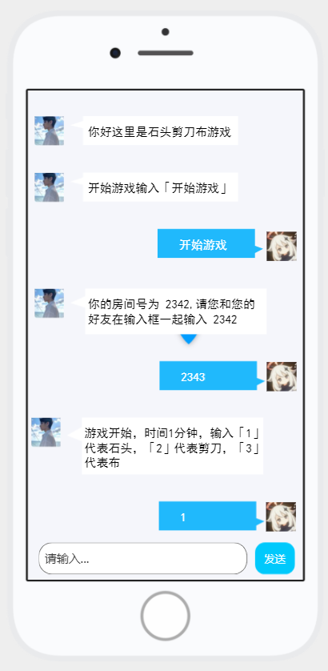

## 一个简单的剪刀石头布
前端使用 uniapp

[前端代码https://github.com/dengjiawen8955/jsb-uniapp.git](https://github.com/dengjiawen8955/jsb-uniapp.git)

后端使用 go

* 登录使用 HTTP 然后

* 状态储存使用 jwt token  验证

* 游戏过程保持 websocket 连接
  (前端做 TCP 不好做，又没有做过前后端的 websocket 交互，时间有限，先用 HTTP 阻塞 10-20 秒返回来做)
  (虽然不建议将 HTTP 阻塞来看实现数据传输，但是也能用，先做好，后面看看 websocket 前端怎么弄)

### UI 图

